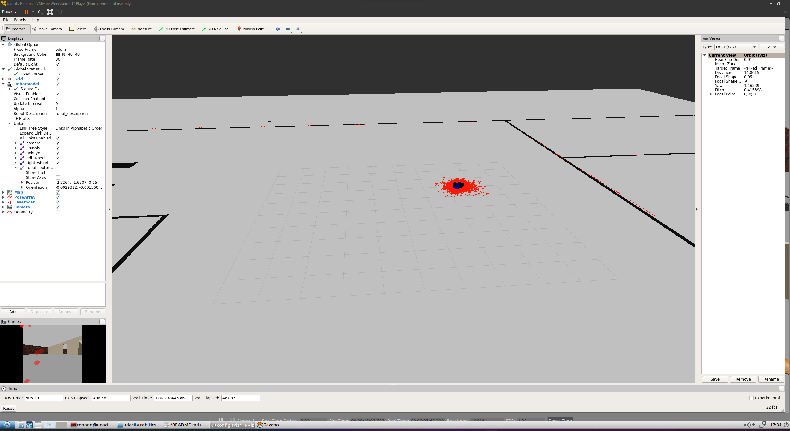

## Running

### Build

```bash
$ cd catkin_ws
$ catkin_make
$ source develop/setup.bash
```

### Launch Gazebo and RViz

```bash
$ roslaunch my_robot world.launch
```

### Launch AMCL

```bash
$ roslaunch my_robot amcl.launch
```

### Launch Teleop

```bash
$ rosrun teleop_twist_keyboard teleop_twist_keyboard.py
```

### Test

Drive the robot around using teleop and observe the map overlay in rviz adjust to match the actual surroundings.


### Images

Gazebo


RViz Un-Localized


RViz Localized


Video

